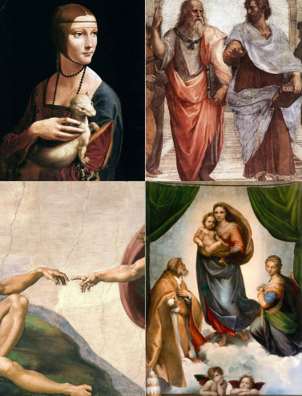
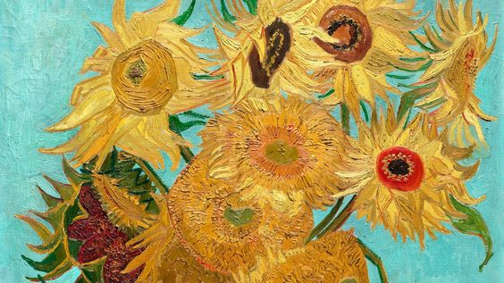

<samp>
  

   
  

  

<b align="left">Sobre mim:</b>

Meu nome é Pedro, tenho 24 anos, atualmente estou estudando desenvolvimento backend e estou em um relacionamento complicado com o Java, pois ando flertando com o Python.😅

Sou admirador da arte e há aproximadamente 3 anos venho me aventurando na arte da codificação 👨‍💻

   
  

  
<b>você pode me encontrar em:</b>

  
  

  

  
📲 Pode me mandar mensagem no <a href ="https://t.me/pdrTuche">Telegram</a>, vou gostar de conversar sobre tecnologia com você ^^

  

  </samp>
 
  

  
 <b> Projetos em Destaque </b> <i>(clique para expandir! )</i> 

   

  
  
  
  
  
  
    
  
     
  

  
 
 

  
 <b>📊 GitHub Stats </b><i >(clique para expandir !!)</i> 

   

  <a href = "https://github.com/pdr0nvs">
        <!--
        
     -->
    
        
    
    </a>
        <h3>🏆 GitHub Profile Trophies 🏆</h3>
        
    </a>
 

  
  
  <samp>
  

    
<b>Profile Views: 👀</b>

   
 <!-- -->
  
 
</samp>

<!--  -->

code is art

